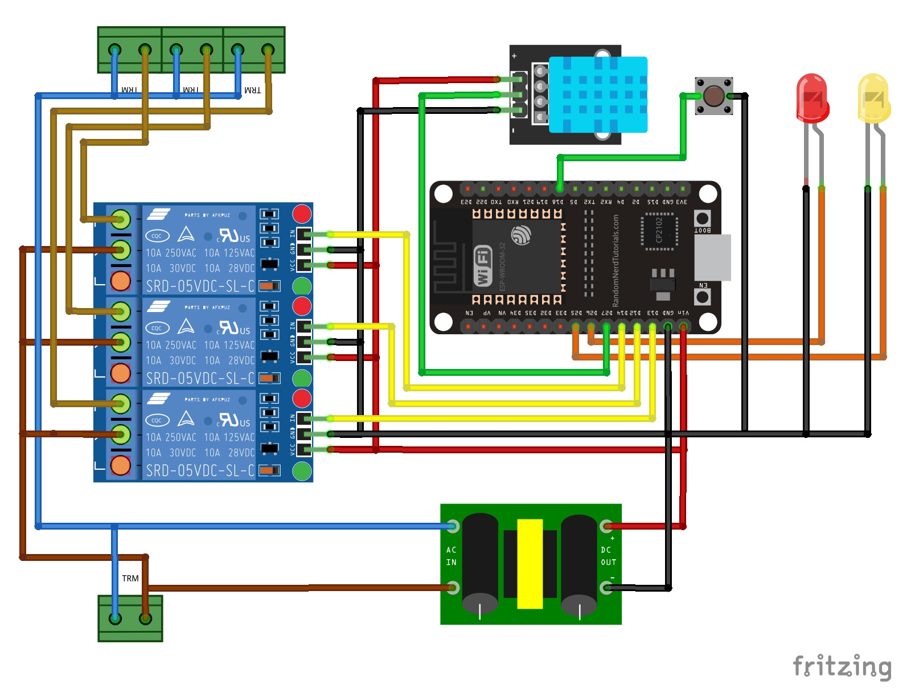

# Mushroom Grow Tent Controller

   

The **Mushroom Grow Tent Controller** is an IoT device designed to automate and control the environment inside a mushroom grow tent. It provides full control of temperature, humidity, and lighting, making it ideal for mushroom cultivation.

This project utilizes an **ESP32 board** along with other components to manage the mist maker, fan, and light. The device operates both in **Access Point mode** and **WiFi mode**, and can be controlled through a web-based UI that is compatible with desktop, tablet, and mobile devices.

## Features

- **Automated Environment Control:**
  - Automatically turns the **mist maker** and **fan** on/off based on user-defined temperature and humidity thresholds.
  - Automatically turns the **light** on/off according to a schedule, synced with NTP servers for accurate timing (requires WiFi mode for NTP synchronization).
  
- **Web-based Control Panel:**
  - Manual control of the **light**, **mist maker**, and **fan** through a user-friendly web UI.
  - Configure the automatic **on/off time** for the light via the web interface.
  - Set the target **temperature** and **humidity** thresholds for the automated control of the mist maker and fan.
  - Real-time display of the **current temperature and humidity**.
  - **Real-time updates** of the **on/off state** for the mist maker, fan, and light across all connected devices.
  - **Configurations are saved**: All user configurations are stored in the **ESP32's flash memory**, so they are **retained even after a power outage**.

- **Modes of Operation:**
  - **Access Point Mode**: The device creates its own WiFi network with the SSID `growcontroller` and password `KLJ_Creations`. The web UI can be accessed at `growcontroller.local`. NTP synchronization for light scheduling is unavailable in this mode.
  - **WiFi Mode**: Connect the device to an existing WiFi network by entering the SSID and password through the UI (`growcontroller.local/wificonfig`). The hostname can be customized when in this mode.

- **Multi-Client Support:**
  - Multiple client devices can connect to the web UI simultaneously. All connected clients receive real-time updates of the system's state.

- **Additional Features:**
  - **NTP Synchronization**: Automatically syncs time with NTP servers for accurate light scheduling (WiFi mode required).
  - **Indicator LEDs**: 
    - One LED indicates when the device is in Access Point mode.
    - Another LED indicates sensor connection failure.
  - **Reset Button**: Press and hold the reset button for 5 seconds to switch to Access Point mode. The Access Point indicator LED will blink, then remain solid once the device enters Access Point mode.

## Technologies Used

- **Programming Languages**: 
  - Arduino
  - HTML
  - CSS
  - JavaScript
  - JSON

- **Libraries & Protocols**:
  - AsyncWebServer
  - WebSockets
  - EEPROM
  - mDNS (Multicast DNS for local network device discovery)
  - NTP (Network Time Protocol) for light scheduling

## Hardware Used

- 1 x **ESP32 board**
- 1 x **DHT11 sensor** (for temperature and humidity measurement)
- 1 x **3-relay module** (for controlling the mist maker, fan, and light)
- 2 x **LEDs** (for mode and sensor failure indication)
- 1 x **Push button** (for resetting to Access Point mode)
- 1 x **230V AC to 5V DC converter** (to power the ESP32)

## Setup Instructions

1. Clone this repository to your local machine:
   ```bash
   git clone https://github.com/kavindalj/mushroom-grow-tent-controller.git
   ```

2. Set up your hardware according to the wiring diagram:

   

3. Flash the ESP32 with the provided Arduino code.

4. Access the web UI:
   - **In Access Point mode**: Connect to the WiFi network `growcontroller` with the password `KLJ_Creations`. Open your browser and go to `growcontroller.local`.
   - **In WiFi mode**: After configuring your WiFi via the UI (`growcontroller.local/wificonfig`), access the device at `hostname.local` (where `hostname` is your custom name for the device).

5. Use the web UI to monitor and control the environment of your grow tent.

## Contributing

Feel free to submit issues or pull requests to contribute to this project. Feedback and improvements are always welcome!

## License

This project is licensed under the MIT License - see the [LICENSE](LICENSE) file for details.
